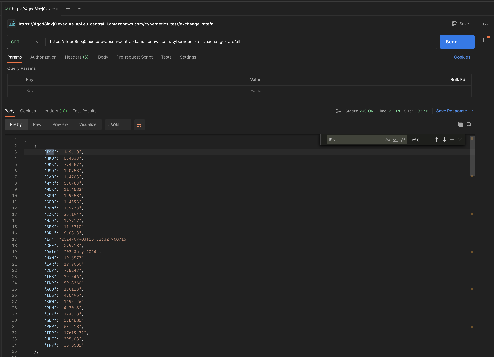
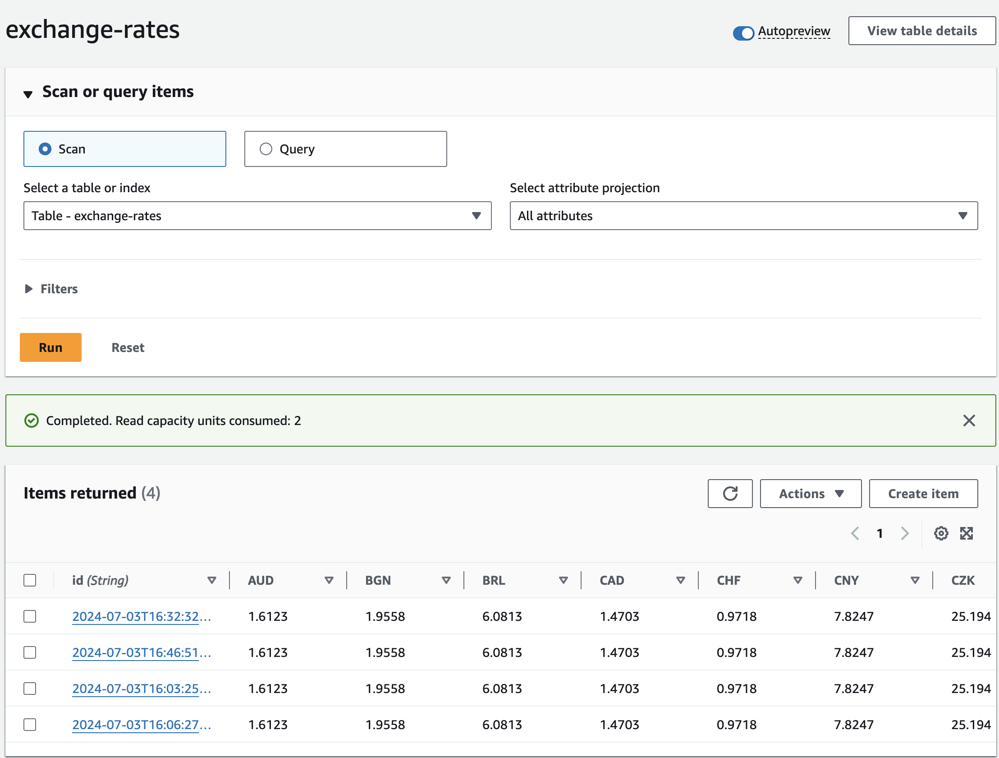
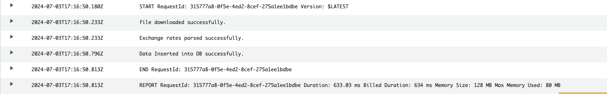

# EURO Exchange Rate

This repository contains the code of the EURO Exchange Rate. The can be used as a base for serverless API utilising AWS and Typescript.

## Setup and Provisioning

### Prerequisites

- AWS Account
- [Python3.12](https://www.python.org/downloads/release/python-3120/)
- [Terraform](https://developer.hashicorp.com/terraform/tutorials/aws-get-started/install-cli)
- [Install AWS Cli](https://docs.aws.amazon.com/cli/latest/userguide/getting-started-install.html)
- [Configuring AWS Credential](https://docs.aws.amazon.com/cli/latest/userguide/cli-chap-configure.html)

### Provisioning

This repository has two sub directories `backend` and `infrastructure`. As backend code for lambda functions are written in `python`.

#### Backend
- get-all-exchange-rates (To understand euro rate changed compared to the previous day.)
- get-exchange-rates (To get current exchange rates)
- update-exchange-rates (To update euro rate to the database cron job)

Once the build is successful, now infrastrcuture is ready to be deployed.

#### Infrastructure

- Configure AWS Credentials on your CLI terminal

```bash
terraform init
terraform apply
```

On running `terraform apply` command, user will be prompted to confirm the changes to be deployed. Once the infrastructure is deployed successfully, Note the API URL against the `api_gateway_url` output.

Note: The API will be availble on : `api_gateway_url/stage_name` (stage_name: )

The API documentation is available on [SwaggerHub](https://app.swaggerhub.com/apis-docs/ShaheerKhan/euro-exchange_rate_api/1.0.0)

### Screenshots







### Assumptions
- I have used the zip path from the [Euro Exchange Rate](https://www.ecb.europa.eu/stats/policy_and_exchange_rates/euro_reference_exchange_rates/html/index.en.html) and I assume the path will not changed.
- The file present in the ZIP on above mentioned path will not change the naming convetions (eurofxref.zip, eurofxref.csv)

### TODO

- Configured CronJob for 5 minutes for testing but it should be triggered after every 12 hours or 4:00 PM CET (cron express)
- Add logic to compare the exchange rate for the previous date
- Add Environment variable for lambda functions (TableName, FilePath, )
